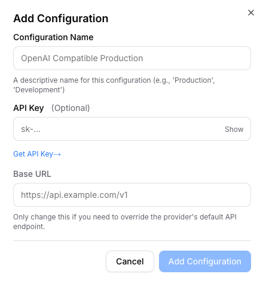

# Cloudflare AI Deployer

Deploy an **OpenAI-compatible endpoint** backed by [Cloudflare Workers AI](https://developers.cloudflare.com/workers-ai/) to your own Cloudflare account. Pick the models you want and you get a URL + bearer key you can drop into any OpenAI SDK.

Supports `chat/completions` (including vision models), `embeddings`, `audio/transcriptions`, and `audio/speech` — each endpoint is enabled only if you list a model for it.

There are **two ways to use this project**:

| | |
|---|---|
| **[open.notebooker.ai](https://open.notebooker.ai)** | Hosted web app. Paste a scoped Cloudflare API token, pick models from the live catalog, deploy, and test chat / speech / vision / embeddings right in the browser. No install. Nothing is stored server-side — your token lives in an encrypted session cookie, config lives in your own account. |
| **This repo (CLI)** | Clone, edit `models.json`, run `npm run deploy`. Good for scripting, CI, and version-controlled model config. |

Both deploy the exact same worker (`workers/template-unified.js`).

## Option 1 — the web app (easiest)

1. Open **[open.notebooker.ai](https://open.notebooker.ai)**.
2. Follow the *Before you start* checklist (verify your Cloudflare email; visit
   [Workers AI](https://dash.cloudflare.com/?to=/:account/ai/workers-ai) once so
   your `workers.dev` subdomain gets registered).
3. Create a **Custom API token** with: Workers Scripts *Edit*, Workers KV Storage
   *Edit*, Workers AI *Read*, Account Analytics *Read* — scoped to your account.
4. Paste it in, pick your models, hit deploy. Test everything in the browser and
   download a `credentials.txt` with your base URL + key.

Your token is never stored (encrypted, expiring session cookie only), and neither
is your endpoint key — save it when it's shown, or download the credentials file.

## Option 2 — the CLI

### Prerequisites

- Node.js 18+
- A [Cloudflare account](https://dash.cloudflare.com/sign-up) (the free plan is enough to get started)
- Your **Cloudflare Account ID** and a **Cloudflare API token** — see below

#### Find your Account ID

1. Open the [Cloudflare dashboard](https://dash.cloudflare.com/).
2. Pick any site, or go to **Workers & Pages** → **Overview**.
3. Your Account ID is shown in the right-hand sidebar — click to copy.

Direct link: **https://dash.cloudflare.com/?to=/:account/workers-and-pages**

#### Create an API token

1. Go to **https://dash.cloudflare.com/profile/api-tokens**.
2. Click **Create Token** → **Create Custom Token**.
3. Give it a name (e.g. `cloudflare-ai-deployer`) and add these permissions:

   | Type     | Resource           | Permission |
   |----------|--------------------|------------|
   | Account  | Workers Scripts    | Edit       |
   | Account  | Workers AI         | Read       |
   | User     | User Details       | Read       |

4. Under **Account Resources**, scope it to the account you got the Account ID from.
5. Click **Continue to summary** → **Create Token** and copy the token (you only see it once).

> The built-in **"Edit Cloudflare Workers"** template also works if you'd rather not pick permissions manually — it just grants more than is strictly needed.

### Setup

```bash
git clone https://github.com/Notebooker-ai/cloudflare-ai-deployer
cd cloudflare-ai-deployer
npm install
cp .env.example .env
```

Then open `.env` and fill in:

```
CLOUDFLARE_API_TOKEN=...
CLOUDFLARE_ACCOUNT_ID=...
```

### Pick your models

Open `models.json`. The keys are the four supported endpoint types; the values are Cloudflare Workers AI model ids. **Omit any key to disable that endpoint.**

```json
{
  "chat": "@cf/meta/llama-3.3-70b-instruct-fp8-fast",
  "embedding": "@cf/baai/bge-base-en-v1.5",
  "text_to_speech": "@cf/myshell-ai/melotts",
  "speech_to_text": "@cf/openai/whisper-large-v3-turbo"
}
```

Browse the full catalog and copy-paste any model id from the Cloudflare model directory:

**https://developers.cloudflare.com/workers-ai/models/**

Filter by task type to find a model for each slot:

| `models.json` key | Cloudflare filter         | Example model ids |
|-------------------|---------------------------|-------------------|
| `chat`            | **Text Generation**       | `@cf/meta/llama-3.3-70b-instruct-fp8-fast`, `@cf/qwen/qwen3-30b-a3b-fp8` |
| `embedding`       | **Text Embeddings**       | `@cf/baai/bge-base-en-v1.5`, `@cf/google/embeddinggemma-300m` |
| `text_to_speech`  | **Text-to-Speech**        | `@cf/myshell-ai/melotts`, `@cf/deepgram/aura-2-en` |
| `speech_to_text`  | **Automatic Speech Recognition** | `@cf/openai/whisper-large-v3-turbo`, `@cf/deepgram/nova-3` |

If you want vision support, just use a vision-capable model under `chat` (e.g. `@cf/meta/llama-3.2-11b-vision-instruct`).

> **Gated models:** some Meta models require a one-time license agreement per
> Cloudflare account. If you get error 5016, send the single chat message
> `agree` to your endpoint once — the worker forwards the agreement in the
> format Cloudflare expects.
>
> **Note:** `@cf/deepgram/flux` is WebSocket-only and won't work through this
> request/response API.

### Deploy

```bash
npm run deploy
```

On success it prints something like:

```
🌐 Your endpoint is live

   Base URL:        https://cloudflare-ai.<your-subdomain>.workers.dev/v1
   Bearer API key:  3f2a1c…  (64 hex chars)
```

(`<your-subdomain>` is your account's registered `workers.dev` subdomain.)

The bearer key is auto-generated on first deploy and saved to `.env` as `API_KEY`. Re-running `npm run deploy` reuses it.

To rename the worker subdomain, set `WORKER_NAME` in `.env` before deploying.

To preview a deploy without touching Cloudflare:

```bash
npm run deploy:dry-run
```

## Use it

Point any OpenAI-compatible client at the printed `Base URL` and use the printed key.

```js
import OpenAI from "openai";

const client = new OpenAI({
  baseURL: "https://cloudflare-ai.<your-subdomain>.workers.dev/v1",
  apiKey: "<your bearer key>",
});

const res = await client.chat.completions.create({
  model: "chat",
  messages: [{ role: "user", content: "Hello!" }],
});
```

Or with `curl`:

```bash
# Chat
curl $BASE_URL/chat/completions \
  -H "Authorization: Bearer $API_KEY" \
  -H "Content-Type: application/json" \
  -d '{"model":"chat","messages":[{"role":"user","content":"Hi"}]}'

# Embeddings
curl $BASE_URL/embeddings \
  -H "Authorization: Bearer $API_KEY" \
  -H "Content-Type: application/json" \
  -d '{"model":"embedding","input":"hello world"}'

# Text-to-speech (writes wav)
curl $BASE_URL/audio/speech \
  -H "Authorization: Bearer $API_KEY" \
  -H "Content-Type: application/json" \
  -d '{"model":"text_to_speech","input":"Hello!"}' \
  --output speech.wav

# Speech-to-text
curl $BASE_URL/audio/transcriptions \
  -H "Authorization: Bearer $API_KEY" \
  -F "file=@sample.m4a" \
  -F "model=speech_to_text"
```

The `model` field accepts either the type alias (`chat`, `embedding`, …) or the full Cloudflare model id you put in `models.json`.

## Use it with Notebooker.ai

[Notebooker.ai](https://app.notebooker.ai/) ships an embedded instance of [open-notebook](https://github.com/lfnovo/open-notebook) that can talk to any OpenAI-compatible endpoint — so you can point it at your freshly deployed worker.

1. Open the API Keys settings: **https://app.notebooker.ai/open-notebook?path=settings%2Fapi-keys**
2. Under **Models**, add a new **OpenAI Compatible** configuration.
3. Fill in the modal:

   

   - **Configuration Name**: anything memorable (e.g. `Cloudflare Workers AI`)
   - **API Key**: your endpoint's bearer key
   - **Base URL**: your worker's base URL, e.g. `https://cloudflare-ai.<your-subdomain>.workers.dev/v1`

4. Click **Add Configuration**. The models you configured are now available inside Notebooker using their type aliases (`chat`, `embedding`, `text_to_speech`, `speech_to_text`) or their full Cloudflare model ids.

## Running the web app locally

The hosted app at open.notebooker.ai lives in [`web/`](./web) (Astro on Cloudflare
Workers). To run it locally:

```bash
cd web
npm install
npm run dev            # http://localhost:4321
```

`web/.dev.vars` ships with a dev-only `SESSION_SECRET`. Paste a scoped Cloudflare
API token on the landing page (permissions listed there) and you get the full
dashboard against your own account. See [`web/README.md`](./web/README.md) for
architecture, security model, and production deployment.

## Tests

Unit tests run without credentials:

```bash
npm test
```

To run the integration suites against your deployed worker, set `OPENAI_BASE_URL` and `API_KEY` in `.env` (the deploy step already fills `API_KEY`):

```
OPENAI_BASE_URL=https://cloudflare-ai.<your-subdomain>.workers.dev/v1
```

Then `npm test` again — the integration tests will auto-skip any endpoint type that isn't configured in `models.json`.
